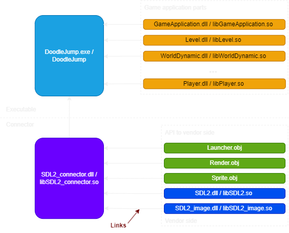
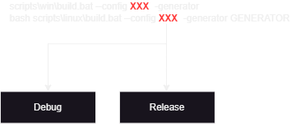
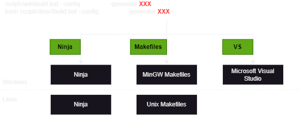
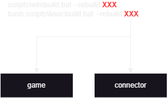

# A Classic Doodle Jump 2D Clone

## Briefly about code base

### What code base is?

Doodle Jump game made in C++ with help of SDL2 libraries.
SDL2 graphic features were putted in a shell - connector.
Basicaly connector hides SDL2 features to allow to be independent from changes in SDL libraries.
Meaning any change in SDL2 or going from SDL2 to SDL3 requires only editing in the connector,
not in the game itself.

There is three main parts:

- Sprite: it holds image data, such as SDL_Texture and destination area rectangle.
- Render: it operates with Sprites. Render's API should be called to create, draw, destroy any Sprite, also to operate
  with Sprite size changes; Render holds SDL_Window* and SDL_Renderer* as static variable,
  cause game needs only one instance of those.
- Launcher: it runs game application. Just pass game application that implements IApplication interface, Launcher
  could run it for you.

### Project architecture

Since it's two main parts, but only one (top level with game itself) needs to be constantly re-configured and rebuilded - it's convinient to split project in two parts.

After code base is cloned to machine you need to build connector once, after that point you done here.

Any changes in game itself requires only rebuild option (look futher for '--rebuild' flag).



### Naming convention

Here is the typical style for header and source files of any library.

```cpp
// Lib.hpp

#pragma once

//* SDL2: Connector
// What we have to include from connector libraries

//* Game
// Game libraries headers

//* C++ std
// Any C++ std header that need to be included directly in the header

//* Forward declarations

class AnyClass
{
public:
	//@ API's
	AnyClass();

	//@ Methods
	ReturnType MemberFunction(ParamType param_variable, bool bSomeFlag);

private:
	//* Let's prevent copying AnyClass object
	AnyClass(const AnyClass&) = delete;
	AnyClass& operator=(const AnyClass&) = delete;

	//@ Members
	Type _memberVariable;

	//? Treating booleas vaariables in some special way,
	//? by using same style as in the UnrealEngine convention
	bool _bInSomeState{false};
};

// Lib.cpp

// What we can include only here to resolve circular dependencies by using forward declarations

//* SDL2: Connector

//* Game

//* C++ std

AnyClass::AnyClass()
{
...
}

ReturnType AnyClass::MemberFunction(ParamType param_variable, bool bSomeFlag);
{
	ReturnType scope_variable{param_variable + _memberVariable};

	return bSomeFlag && _bInSomeState? scope_variable: ReturnType{};
}
```

### How to build executable?

To build SDL2_connector library and game executable you need to run only one script:

```bat
scripts\win\build.bat --config CONFIG --generator GENERATOR
scripts\win\build.bat --generator GENERATOR --config CONFIG
```

```bash
bash scripts/linux/build.sh --config CONFIG --generator GENERATOR
bash scripts/linux/build.sh --generator GENERATOR --config CONFIG
```

Specify configuration (Debug or Release) with generator (Ninja, MinGW Makefiles or Unix Makefiles, Microsoft Visual Studio 17 2022 - however no such option for linux builts)
and script will delete all builds (vendor, connector and game) - if any existed, and configure and build new ones from scratch for you.

This command is for doing same but generator or config don't specified - meaning would be used same
from previous built:

```bat
scripts\win\build.bat --config CONFIG
scripts\win\build.bat --generator GENERATOR
```

```bash
bash scripts/linux/build.sh --config CONFIG
bash scripts/linux/build.sh --generator GENERATOR
```

(NOTE: If built data is absent Debug and Ninja - is default options)

Important to know that the change of configuration or/and generator will lead to necessity in re-building connector from scratch. Meaning vendor supply libraries differently for Debug and Release, also custom shell for connector differs for configuration (for example Logger disabled in Relase mode).
Also good to keep in mind that connector library builded with Visual Studio compiler don't link to executable builded with MinGW compiler.





When you about to change **ONLY** code base of game or connector, and you don't need to re-configure and re-build vendor you can simply re-configure and re-build top level code:

```batch
scripts\win\build.bat --rebuild AIM
```

```bash
bash scripts/linux/build.sh --rebuild AIM
```

Previous scripts are most important that 95% of time for developing a game is changing the game codebase itself, and adding something to connector, so you don't need to build vendor libraries all over again. This is why you can simply re-build only what you need.



### How to run executable?

Build system create ./build and ./executables/{configuration} folders for you.
./executables/{configuration} folder is the destination for installing .exe
and .dlls (.so) libs, also data will be copied here.

Game have been built in a way to run in a different modes.

So you have to specify in a command line window mode (windowed or fullscreen) and resolution.

For example:

```bat
executables\Debug\DoodleJump.exe -fullscreen 1600x900
```

```bash
bash executables/Debug/DoodleJump --fullscreen 1600x900
```

This would run previously builded by you Debug version of DoodleJump.exe on Windows (DoodleJump Debug verion on Linux) in a fullscreen mode with 1600 to 900 resolution (of course if you have built Release version, Debug version will be simply deleted and such command will not work).

For convinience you can simply run a script:

```bat
scripts\win\run.bat
```

```bash
bash scripts/win/run.sh
```

It will look into executables folder and run such configured 'executables/{configuration}/DoodleJump.exe' that live there.
Of course, such behavior applies for a case when you didn't change build script,
so build system still delete 'Debug' executables when you build 'Release' and vice verse.

But if you want to change build script, and you don't wanna delete Debug/Release configuration when producing Release/Debug - don't forget to change run script to run exact configuration that you want to run.

Finally, run this script to delete all builds folders, executables and binaries:

```bat
scripts\win\delete_all.bat
```

```bash
bash scripts/win/delete_all.sh
```

## About game

Welcome! Start your gateway to endless jumping fun! This is a delightful and addictive arcade game that puts you in control of a bouncy character on a mission to reach new heights. Inspired by the timeless classic Doodle Jump, this game brings back the nostalgia of simple yet captivating gameplay.

### Features:

1. Endless Jumping Excitement: Experience the thrill of endless jumping as you bounce from platform to platform in a vibrant and colorful world.
2. Simple Controls, Addictive Gameplay: With easy-to-learn controls, DoodleJump is accessible to players of all ages. Just tilt your device to guide your character left and right, and watch them leap higher and higher!
3. Challenging Obstacles: Test your reflexes and agility as you encounter various obstacles, enemies and wormholes while climbing. Dodge monsters, avoid traps, and collect power-ups to boost your journey.
4. Compete for High Scores: Challenge yourself to beat your own high score, or compete with friends and players from around the world on the global leaderboard. Can you climb to the top and become the ultimate DoodleJump champion?

### Controls:

Doodle jump off platform automatically when player move it to the edge of the platform. To move use **LEFT\RIGHT keyboard arrow keys**. Doodle is able to take a long fly: press **UP keyboard arrow key**, Doodle will jump in 10 seconds, after that it would take 2 seconds to recharge fly ability.

_Don't stay too long on the platform: after 2 seconds it will disappear, but you still will be able to jump off from it._

There is enemies in the level. Jump on them to kill. If you go to the bottom, left, right side of the enemy - you will die. You also able to kill enemies by shooting at them ammo projectiles. Press **LEFT mouse button** to shoot. Ammo will be aim to the point where cursor when shoot.

If Doodle suddenly go below screen - he will die. If Doodle go thru right border of the screen it appears at the left, and vice versa.

There is also wormholes on the level that will suck Doodle into it, changes his trajectory.
When Doodle will stuck in the wormhole it will die.

After any death level reloads.

To close game press **Esc** key.

You will achive points from: distance you pass and platforms you fly.


